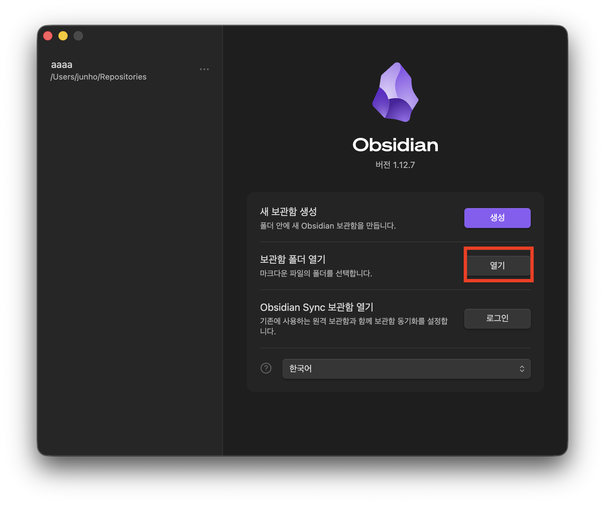
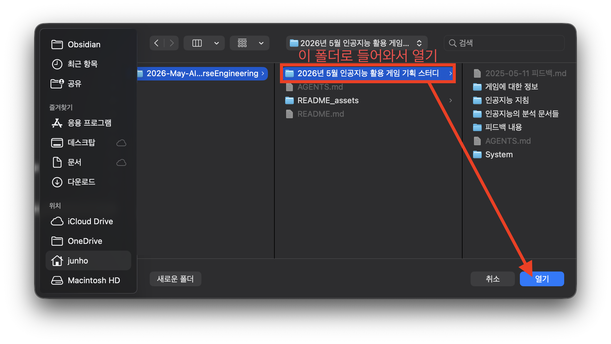
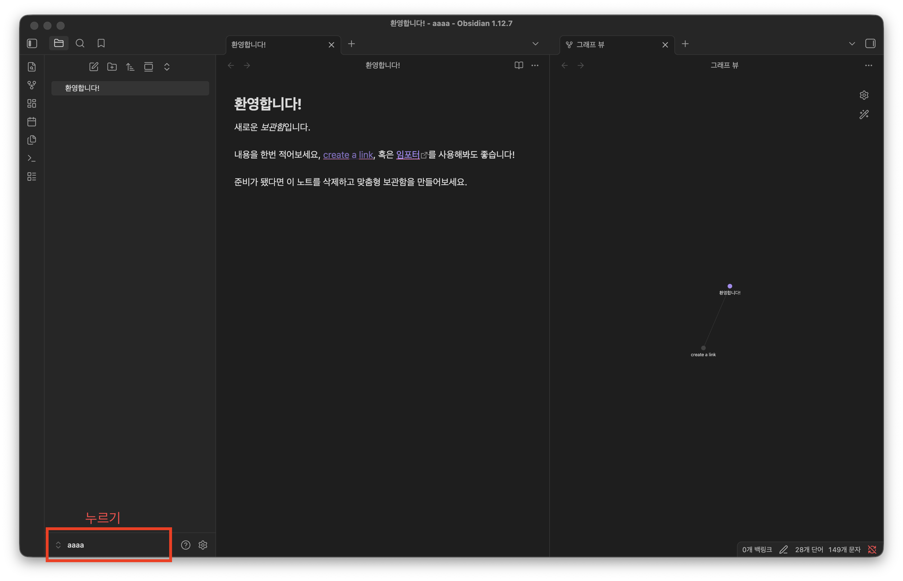
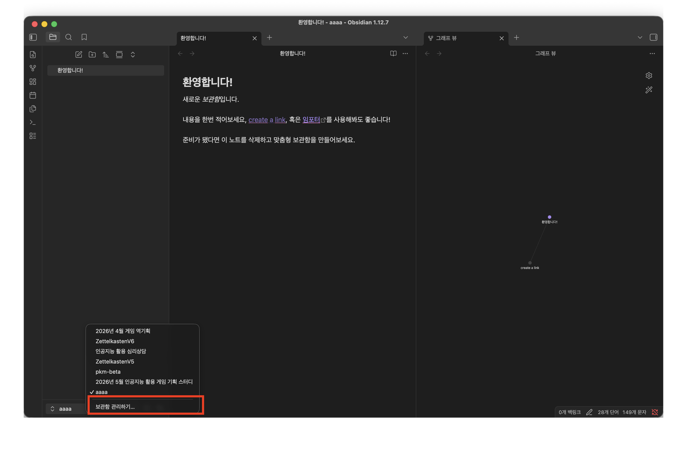

# 인공지능 활용 게임 역기획 분석 프로젝트

본 프로젝트는 수기로 작성된 게임 역기획서를 인공지능(AI)을 통해 분석하고, 기획적 결함을 보완하여 더 높은 완성도의 역기획서를 만들어가는 스터디 공간입니다.

## 프로젝트 목표
- **문제점 인식**: 기존 역기획서의 논리적 오류나 데이터 누락을 AI로 탐색.
- **개선 및 고찰**: 전문 기획자의 시각을 가진 AI와 함께 더 나은 시스템 및 메커니즘 설계.
- **비교 분석**: 원본 문서와 개선된 기획안을 대조하여 발전 과정을 기록.

## 도구 및 환경
- **주요 도구**: Obsidian (지식 관리), AI Agents (베테랑 기획자 페르소나)
- **대상 게임**: 마라톤 (Marathon, 2026년작 익스트랙션 슈터)

---

## 주의할 점

### 템플릿으로 활용하여 본인의 프로젝트에 적용하고 싶은 경우

이 프로젝트는 옵시디언의 **보관함(또는 'Vault'라고도 부름)** 구조를 사용합니다.

`.obsidian` 폴더가 들어있는 하나의 폴더가 하나의 옵시디언 보관함이기 때문에, 템플릿으로 삼아 본인의 프로젝트에 적용하고 싶은 경우 폴더를 복사하여 이름을 바꾸어 사용하시면 됩니다.
다음의 파일을 제외하고는 자유롭게 수정하여 사용하시면 됩니다:

- **`.obsidian` 폴더**: 작성자가 설정한 옵시디언의 환경설정, 테마, 커뮤니티 플러그인, 단축키 등의 환경 설정이 담겨 있는 플러그인.
  - 함부로 건드리면 옵시디언 구동 환경에 문제가 발생할 수 있으며, 이 경우에는 옵시디언 관련된 설정들을 초기화해야 하니 함부로 건드리시면 안됩니다.
  - 단, 옵시디언 앱에서 설정을 건드리는 것은 유저의 편의성을 위해 오히려 권장합니다.
- **`AGENTS.md` 파일**: 인공지능이 이 보관함을 어떻게 다루어야 할지 알려주는 핵심 지침서입니다.
  - 기초적인 지침에 대해 작성된 파일입니다. 절대로 삭제해서는 안됩니다.
  - 다만 본인이 원하는 규칙을 추가하거나 사용감을 개선하기 위해 내용을 **수정**하는 것은 오히려 적극 권장합니다.
- **핵심 폴더의 이름 및 구조**
  - `AGENTS.md` 지침이나 내부 템플릿에서 `System/Templates/`같은 특정 폴더 경로를 참조하고 있을 수 있습니다.
- **템플릿 파일의 메타데이터 구조**
  - 문서 상단에 있는 `---`로 둘러싸인 속성들은 `yaml` 문법으로 작성되었습니다. 이는 인공지능이 문서를 분류하고 읽기 위한 핵심 단서이므로, 함부로 수정하지 않는 것을 권장드립니다.
  - 내용을 추가하는 것은 괜찮지만, 형식을 완전히 파괴해버리면 향후 인공지능 LLM 연동 시 문제가 발생할 수 있습니다.

## 옵시디언 보관함 여는 법

### 1. 옵시디언 설치
[옵시디언 공식 사이트](https://obsidian.md)에서 앱을 다운로드하여 설치합니다.

### 2. 볼트(보관함) 열기

현재 사용 상황에 맞춰 아래 단계를 따라 프로젝트를 열어주세요.

#### 상황 A: 옵시디언을 처음 설치한 경우
1. 옵시디언 실행 후 나타나는 시작 메뉴에서 **보관함 폴더 열기** 항목의 **[열기]** 버튼을 클릭합니다. 

2. 폴더 선택 창이 뜨면, 본 저장소의 **`2026년 5월 인공지능 활용 게임 기획 스터디`** 폴더를 찾아 선택하고 **[열기]**를 누릅니다.

> **💡 팁 (macOS 사용자)**: `.obsidian` 설정 폴더가 보이지 않아도 해당 이름의 상위 폴더를 선택하면 됩니다. 숨김 파일을 보고 싶다면 `Cmd` + `Shift` + `.`를 눌러주세요.

---

> **⚠️ 주의**: 반드시 `.obsidian` 폴더가 들어있는 **루트 폴더(`2026년 5월 인공지능 활용 게임 기획 스터디`)**를 직접 선택해야 설정된 테마와 플러그인이 올바르게 로드됩니다.

#### 상황 B: 이미 다른 보관함을 사용 중인 경우
1. 위 사진에 강조된 부분을 클릭합니다.

2. 보관함 선택 창이 뜨면 **'보관함 관리하기'** 버튼을 누릅니다.

3. 그럼 시작 메뉴가 등장합니다.  상황 A에서 설명했던 것과 동일한 방식으로 진행합니다.
---

## 📝 주요 문서 안내
- **`AGENTS.md`**: AI 에이전트가 지켜야 할 분석 수칙과 페르소나 설정.
- **`인공지능 지침/역기획_분석_가이드.md`**: 분석 보고서의 품질을 유지하기 위한 가이드라인.
- **`인공지능의 분석 문서들/`**: AI가 분석하고 개선한 결과물들이 저장되는 공간.
